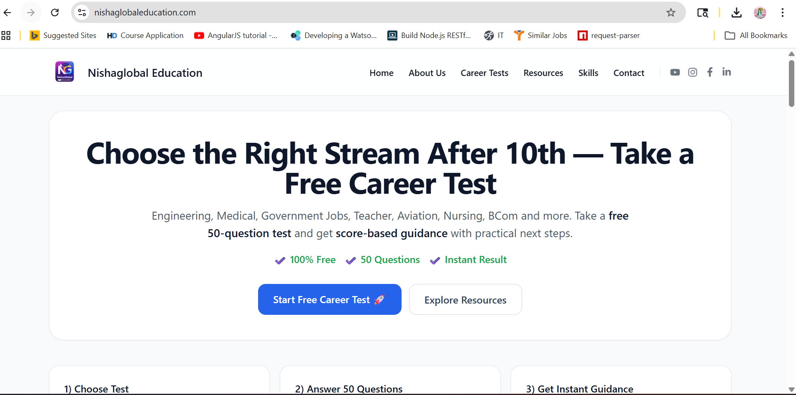
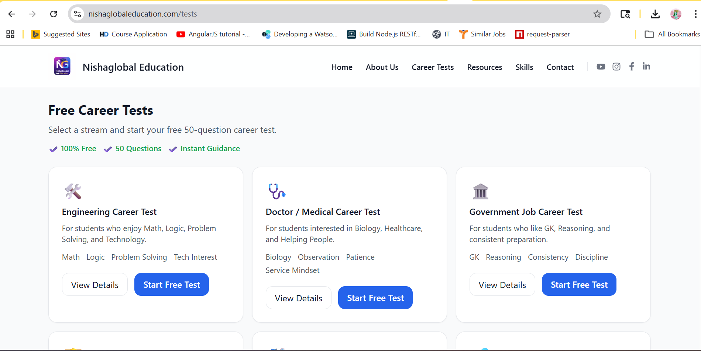
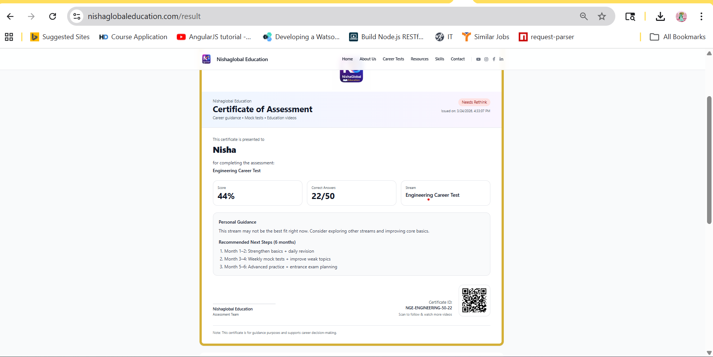

# 🌐 Nishaglobal Education

🚀 **Career Guidance Platform for Students After 10th & 12th**

[](https://nishaglobaleducation.com)
[](https://nextjs.org/)
[](#license)

🔗 **Live Website:** https://nishaglobaleducation.com

---

## 📌 Overview

**Nishaglobal Education** is a modern career guidance platform designed to help students choose the right career path based on their interests, skills, and strengths.

It eliminates confusion by providing **data-driven recommendations instead of guesswork**.

---

## 🎯 Key Features

* 🎯 **Free 2-Minute Career Test**
* 📊 **50 Questions per Stream**
* 🧠 **Smart Recommendation System**
* 🎓 **7 Career Streams**
* 📱 **Mobile-First Responsive Design**
* 🔗 **Social Sharing + QR Code**
* 📄 **PDF Report Generation (In Progress)**

### 🎓 Available Streams

* Engineering
* Medical
* Government Jobs
* Teacher
* Aviation
* Nursing
* BCom

---

## 📸 Screenshots





---

## 🧠 Career Recommendation Logic

| Score  | Recommendation       |
| ------ | -------------------- |
| 60–70% | Try with more effort |
| 70–80% | Good option          |
| 80–90% | Strong fit           |
| 90%+   | Excellent match      |

---

## 🏗️ Tech Stack

### Frontend

* Next.js (App Router)
* React 19
* TypeScript

### Styling

* Tailwind CSS

### Libraries

* html2canvas
* jsPDF
* qrcode.react
* React Icons

---

## 📁 Project Structure

```bash
/app
  /tests
  /resources
  /skills
/components
/data
/public
/styles
```

---

## 🚀 Setup & Run

```bash
npm install
npm run dev
```

👉 Open: http://localhost:3000

---

## 🌐 Deployment

* **Hosting:** Vercel
* **Domain:** nishaglobaleducation.com
* **CI/CD:** GitHub → Vercel Auto Deploy

---

## 🔗 System Architecture

```bash
User (Browser)
     ↓
Next.js Frontend (Vercel)
     ↓
Test Logic + UI
     ↓
Session Storage (Results)
```

---

## 🧪 Environment Setup

Create `.env.local` file:

```env
NEXT_PUBLIC_SITE_URL=https://nishaglobaleducation.com
```

---

## 📈 Contribution Workflow

We welcome contributions 🚀

### Steps:

1. Fork the repository
2. Create a new branch

   ```bash
   git checkout -b feature/your-feature-name
   ```
3. Commit changes
4. Push to your branch
5. Create Pull Request

---

## 🧠 AI Roadmap (Future Vision)

* 🤖 AI-based career recommendation engine
* 🧠 Personalized learning paths
* 📊 Skill gap analysis
* 🎯 Smart career prediction system
* 💬 AI chatbot for student guidance

---

## 📢 SEO & Pages

* Privacy Policy
* Terms & Conditions
* Structured Data (Schema.org)
* Mobile-first SEO

---

## 📧 Contact

📩 [nishaglobaleducation@gmail.com](mailto:nishaglobaleducation@gmail.com)

---

## ⭐ Support

If you find this project useful:

👉 Star this repository
👉 Share with students
👉 Contribute to improve

---

## 🧾 License

This project is intended for **educational and career guidance purposes only**.

---

💡 *Built with a mission to guide students toward the right future.*
